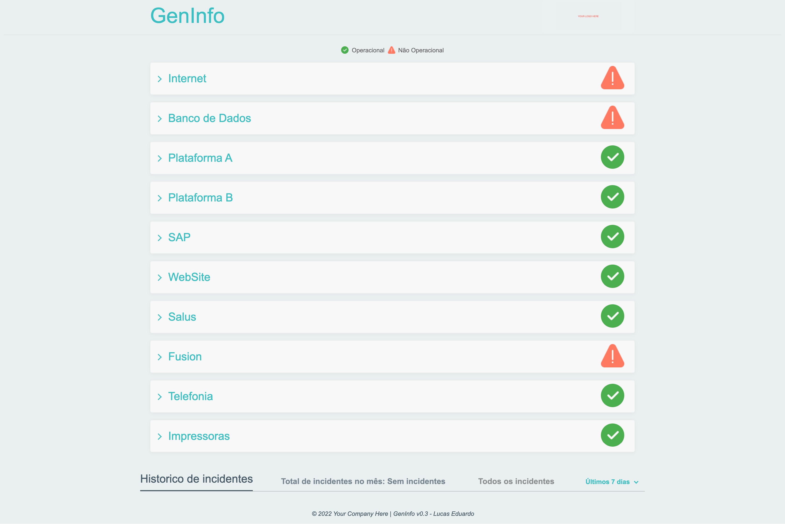

# Heroku Geninfo  [](https://heroku.com/deploy?template=https://github.com/genomika/geninfo/)

[](LICENSE.txt)
[](https://github.com/genomika/geninfo/actions/workflows/django.yml)
[](https://github.com/psf/black)


## About
Geninfo is a open-source project for any brazilian company interested on monitoring and tracking your infra-structure (machines, network, etc) as a realtime status monitor checker for any user. Please we recommend reading our blog post with all motivation about why and for whom we decided to build this project.

[](https://github.com/genomika/geninfo/blob/main/.github/docs/screenshot.jpg?raw=true)


## Tech stack

This project provides an example of our Django (Client/Server) based application hosted on Heroku with a Gunicorn Django setup. There are a lot of state of the art libraries and tools like:


- [PostgreSQL](https://www.postgresql.org/), for DB.
- [prospector](https://prospector.landscape.io/en/master/), for automated quality assurance.
- [Sendgrid](https://sendgrid.com/), for E-mail sending

For continuous integration, a [Github Action](https://github.com/features/actions) configuration .github/workflows/main.yml is included.


Also, includes a Heroku app.json and a working Django production.py settings, enabling easy deployments with ['Deploy to Heroku' button](https://devcenter.heroku.com/articles/heroku-button).

## Running this app

You'll need to have [Docker installed](https://docs.docker.com/get-docker/).
It's available on Windows, macOS and most distros of Linux.

#### Clone this repo anywhere you want and move into the directory:

```sh
git clone https://github.com/genomika/geninfo geninfo
cd geninfo

# Optionally checkout a specific tag, such as: git checkout 0.3.0
```

#### We have some environment files and a docker-compose for local testing

```sh
cp .env.example .env
cp docker-compose.yml.example docker-compose.yml
```

#### Build everything:

*The first time you run this it's going to take 5-10 minutes depending on your
internet connection speed and computer's hardware specs. That's because it's
going to download a few Docker images and build the Python + Pip dependencies.*


We have created *Makefile* with several aliases with common commands so you can start
your environment with a few commands.

```sh
make up
```

Now that everything is built and running we can treat it like any other Django
app.

Did you receive an error about a port being in use? Chances are it's because
something on your machine is already running on port 8000. Check out the port
config in the `docker-compose.yml` file to fix this.

#### Setup the initial database:

```sh
# You can run this from a 2nd terminal.
make migrate
```

#### Check it out in a browser:

Visit <http://0.0.0.0:8000> in your favorite browser.

#### You can load some examples from our fake database

By using the *fixtures*, we can load with some fake examples our database.

```sh
# You can run this from a 2nd terminal.
make load
```

#### Don't forget to create the superuser administration for the app

Follow the instructions by providing an username, password and e-mail.

```sh
# You can run this from a 2nd terminal.
make super
```

#### Linting the code base:

```sh
# You should get 0 messages found (that means everything is operational).
make lint
```

#### Collect static files for local run:

```sh
make collect
```

#### Formatting the code base:

```sh
# You should see that everything is unchanged (it's all already formatted).
marke format
```

#### Running the test suite:

We use the [tox](https://tox.wiki/en/latest/) for the automation test workflow or you can run only testing mode.

```sh
# You should see all passing tests. Warnings are typically ok.
make test
```

```sh
# This command will run a full check: lint, tests and format code.
make tox
```

#### Stopping everything:

```sh
# Stop the containers and remove a few Docker related resources associated to this project.
make down
```

You can start things up again with `make up` and unlike the first
time it should only take seconds.


## Deployment

This project comes with an `app.json` file, which can be used to create an app on Heroku from a GitHub repository.

Before deploying, please make sure you've generated an up-to-date `requirements.txt` file containing the Python dependencies. This is necessary even if you've used Docker for local runs. If your repository is public, you can use the following button:

[](https://heroku.com/deploy) 

If you are in a private repository, access the following link replacing `$YOUR_REPOSITORY_LINK$` with your repository link.

- `https://heroku.com/deploy?template=$YOUR_REPOSITORY_LINK$`

## Features Catalog

- `django` for building backend logic using Python
- `djangorestframework` for building a REST API on top of Django
- `django-suit` for a customized django administration suite.
- `psycopg2` for using PostgreSQL database
- `whitenoise` for serving static assets
- `gunicorn` for an app server in both development and production
- `mailhog` for testing our e-mail workflows.
## Contributing

If you wish to contribute to this project, please first discuss the change you wish to make via an [issue](https://github.com/genomika/geninfo/issues).


Copyright (c) 2021 Genomika Diagnosticos.
